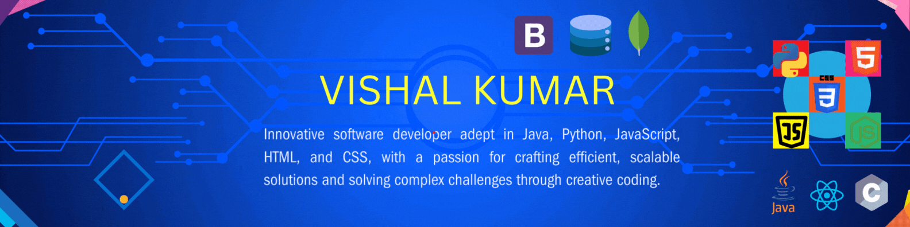

 
   

<h1 align="center">Hi 👋, I'm VISHAL KUMAR</h1>

<h3 align="center">I'm a passionate about Frontend, Backend as wel as Full Stack Developer from India</h3>

- #### I'm currently learning *Some Frameworks and devloping Full Stack projects*
- #### All of my projects are available at here 👉[Project Repository](https://github.com/12vishalkumar?tab=repositories)
- #### 💬 Ask me about *Java, Python, C, DSA, OOPs, HTML, CSS, JavaScript, React.js, Node.js and Bootstrap*
- #### 📩 How to reach me *vk364703@gmail.com*
- #### 📄 Know about my experiences 👉[Click Here](https://drive.google.com/file/d/1boIbLAXVUKEKlbXx8bmhYPdEyAq6e-A5/view)

## Connect with me in social media:

# 💻 Tech Stack's:

# 📊 GitHub Stats:
 

 

 

